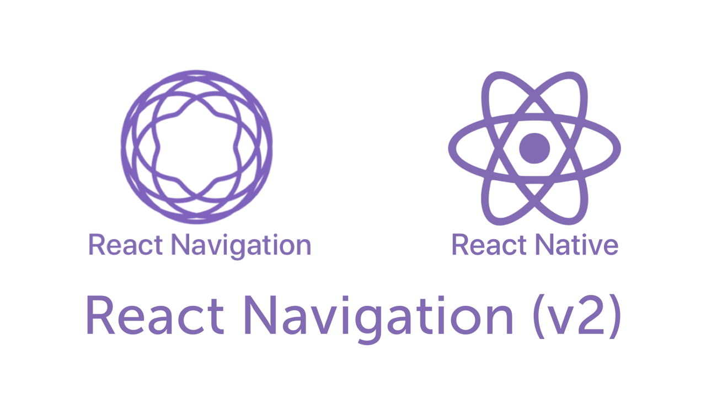

#  Bидео уроки для начинающих по React Native 
### Уровень 1 - Level 1 

> Можете учиться по курсу с Экспо или через эмулятор Андроид или через любой другой стартер. В этом курсе базовые темы, которые работают везде.

### Содержание курса:

Весь плейлист [здесь](https://www.youtube.com/watch?v=6Qnc96d_djk&list=PLth6QPteH5gvv0lVnSQcINI3f8wx-5MsN)

#### 0. [Введение](https://youtu.be/6Qnc96d_djk)
Мы продолжаем и начинаем наш новый курс по теме - навигация в React Native приложении с библиотекой React Navigation второй версии, который будет базироваться на курсе для начинающих в React Native ссылка на него доступна в комментарии к этому видео уроку и на ваших экранах.

#### 1. [Stack Navigator](https://youtu.be/jkUUR-Ru2Qs)
Тема нашего урока - Stack Navigator библиотеки React Navigation второй версии для навигации в React Native приложениях.

#### 2. [Tab Navigator](https://youtu.be/P_jV8qCjRlg)
Возможно, самый распространенный стиль навигации в мобильных приложениях - это навигация на основе вкладок. Это могут быть вкладки внизу экрана или вверху под заголовком (или даже вместо заголовка).

#### 3. [Drawer Navigator](https://youtu.be/x1BkWHncx10)
Этот метод навигации позволяет напрямую переключаться между различными экранами с помощью слайд-ящика. Этот слайд-ящик содержит ссылки на различные экраны приложения.

#### 4. [Z-переход - React Navigation](https://youtu.be/pvbtcorKX3U)
Не стандартные переходы в навигации.

#### 5. [from Children to Parent](https://youtu.be/OnudmpxY6nU)
Передача данных от ребенка к родителю.

#### 6. [Outro](https://youtu.be/ruFyk3cds34)

