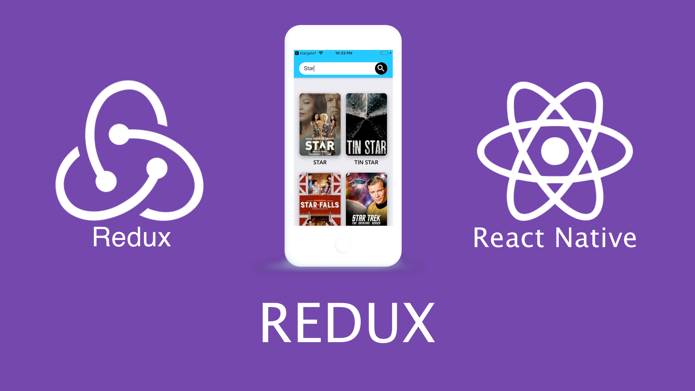
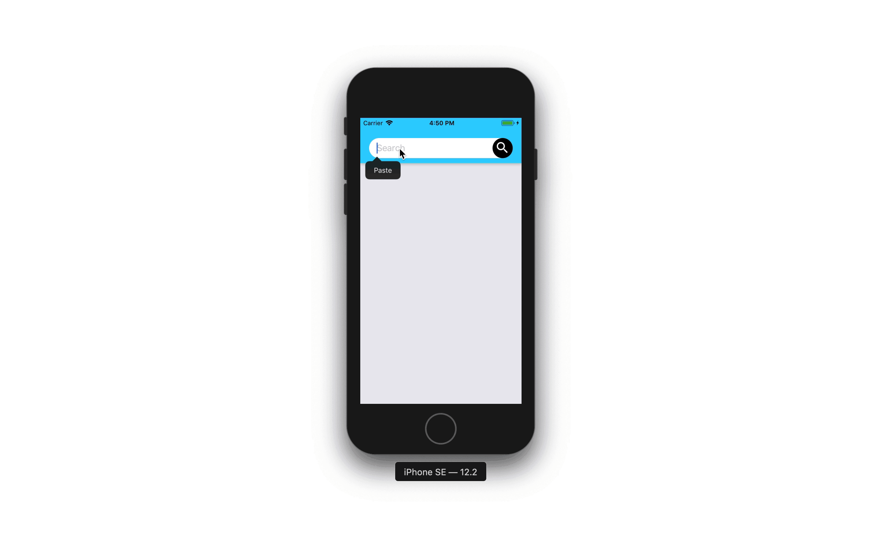

#  Bидео уроки для начинающих по Redux 
### Уровень 1 - Level 1 

> Можете учиться по курсу с Экспо или через эмулятор Андроид или через любой другой стартер. В этом курсе базовые темы, которые работают везде.

### Содержание курса:

Весь плейлист [здесь](https://www.youtube.com/watch?v=KaKiJrVCUrw&list=PLth6QPteH5gvf2huwtOdiuoDH-5vdFSuz)

#### 0. [Основы](https://youtu.be/KaKiJrVCUrw)
Мы продолжаем и начинаем наш новый курс на тему - управление состоянием мобильного приложения с библиотекой Redux в React Native приложениях. В этом курсе мы разработаем с вами мобильное приложение, которое будет искать по базе данных, на сервере фильмы. Этот курс базируется на предыдущих курсах, но если вы не начинающий, а также знакомы с навигацией react navigation, то можно начать с этого курса.

#### 1. [Концепция](https://youtu.be/3iNnqtmEgtg)
В этом уроке мы познакомимся с концепцией Redux.

#### 2. [Установка](https://youtu.be/xTjsEphn7Pg)
Настраиваем рабочее окружение Redux.

#### 3. [Header](https://youtu.be/ycNdEtBMooA)
Рефакторинг кода с прошлых уроков и подготовка Header к следующему уроку.

#### 4. [SearchBar](https://youtu.be/jkKukSinD2I)
Создаем компонент SearchBar, где мы будем вводить название фильма.

#### 5. [Boilerplate](https://youtu.be/qXfb62ik0_k)
Здесь мы научимся создавать стандартный боулерплейт Redux в проектах React Native

#### 6. [Thunk](https://youtu.be/-eE3ySQIV80)
И в завершение мы сделаем запрос на сервер и получим наши фильмы, через Thunk. Сам Redux полностью синхронный, вы можете использовать промежуточное программное обеспечение, такое как redux-thunk для обработки асинхронных действий.
